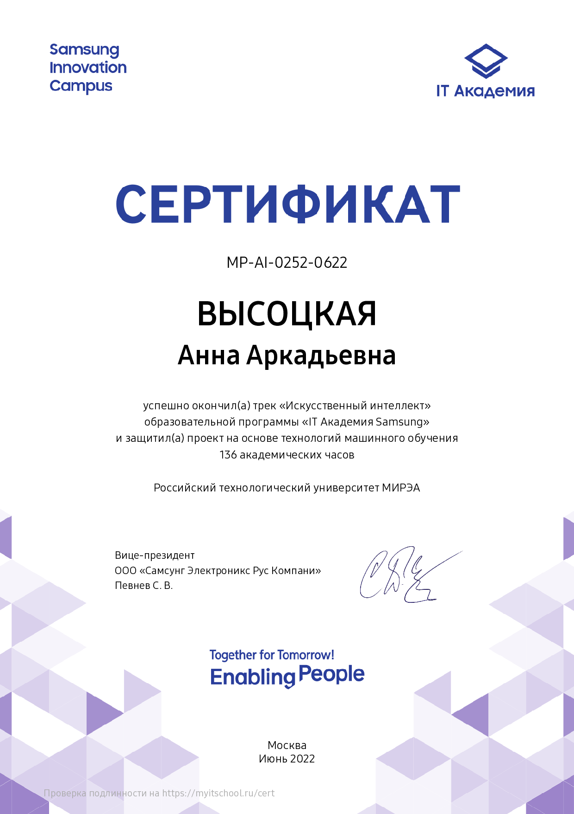
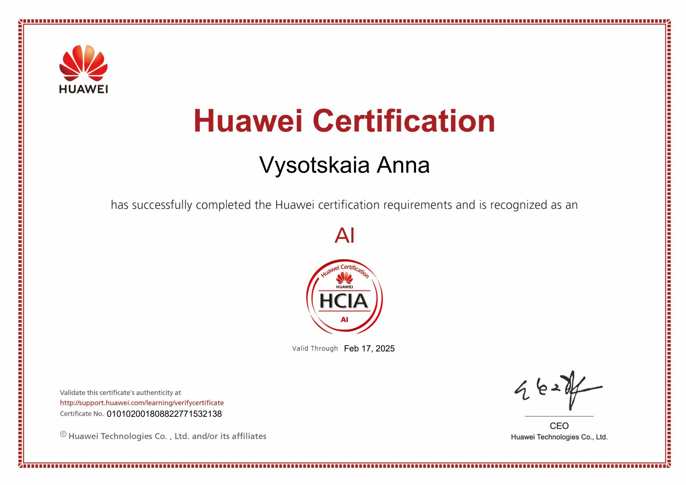
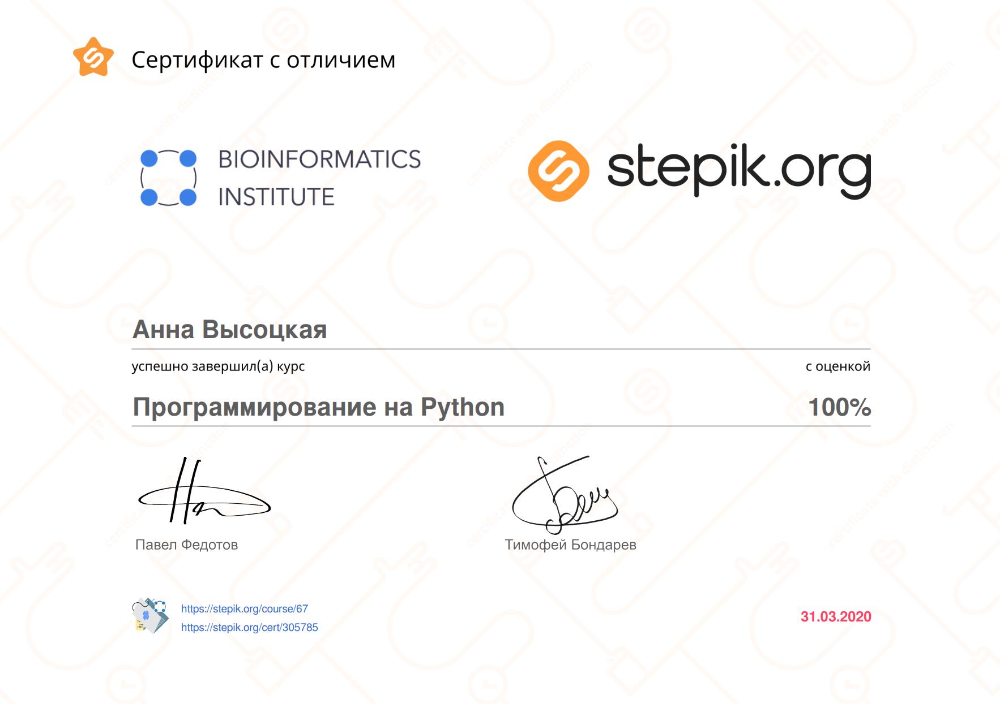

## Привет, я Аня 👋
Около 3 лет работала ассистентом кафедры прикладной математики, вела дисциплины, посвященные анализу данных, машинному обучению, статистике. Выбранное направление подготовки в вузе позволило мне определиться с желаемой профессией. Меня очень увлекает процесс решения задач, связанных с обработкой, анализом различных видов данных, а также создание моделей машинного обучения🚗.

Я ищу возможность реализовать свои компетенции в анализе данных и машинном обучении в реальных проектах, которые оказывали бы положительное влияние на развитие компании. Для меня важно быть частью корпоративной культуры, где я могу получать конструктивную обратную связь по результатам работы.

Даже если что-то кажется сложным и недостижимым, то достаточно разбить этот процесс на простые составляющие и начать делать, что позволяло мне решить каждую поставленную задачу.

Люблю спорт, получила КМС по плаванию, занималась триатлоном, поэтому в свободное время уделяю время тренировкам, чуть-чуть играю в VR и ПК.

  

## Стек

#### Базы данных: ClickHouse, NoSQL (Apache HBase).

#### Инструменты: Google Colab.

#### Библиотеки: XGBoost, CatBoost, LightGBM, Orbit, CausalImpact.

#### Другое: ETL (Sqoop, Flume, NiFi, Pig), Redash, Superset, Airflow, Loginom.

## Задачи
* Статистический анализ данных
* Предобработка данных
* Построение моделей машинного обучения
* Автоматизация отчетности
* Построение дашбордов
* Проведение А/Б тестов

## Сертификаты
KarpovCourses |СБЕР Университет |SAMSUNG AI |HUAWEI AI | Python Stepik |
|-------------|-----------------|-----------|----------|---------------|
||||
||

## Статьи
* [Детекция жестов с помощью YOLO](https://www.elibrary.ru/item.asp?id=49955574) / А. Я. Скляр, А. А. Высоцкая, А. А. Горячев
* [Динамика чисел Вольфа и структурные функции Колмогорова](https://www.elibrary.ru/item.asp?id=54680096) / А. А. Высоцкая, Е. Н. Пронина
* [Анализ случайных процессов со стационарными приращениями на примере чисел Вольфа](https://cyberleninka.ru/article/n/analiz-sluchaynyh-protsessov-so-statsionarnymi-prirascheniyami-na-primere-chisel-volfa) / А. А. Высоцкая
* [Analysis of primary energy consumption in the united states](https://wseas.com/journals/ps/2021/a365116-009(2021).pdf) / A. A. Vysotskaya, A. A. Vorontsov, R. I. Dzerzhinsky
* [Oil Consumption Analysis in the USA in Current Time](https://link.springer.com/chapter/10.1007/978-3-030-90318-3_10) / A. A. Vysotskaya, R. I. Dzerzhinsky, E. N. Pronina

<!--
**anVysa/anVysa** is a ✨ _special_ ✨ repository because its `README.md` (this file) appears on your GitHub profile.
